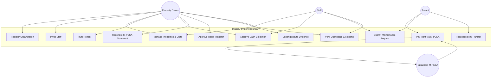
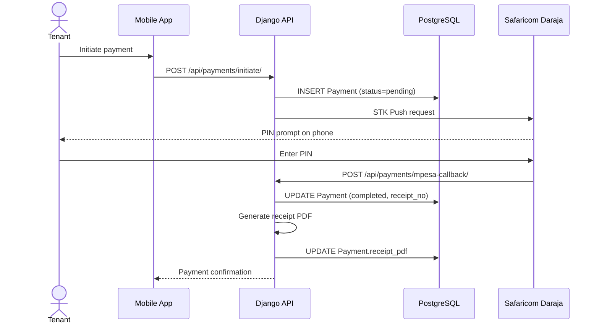
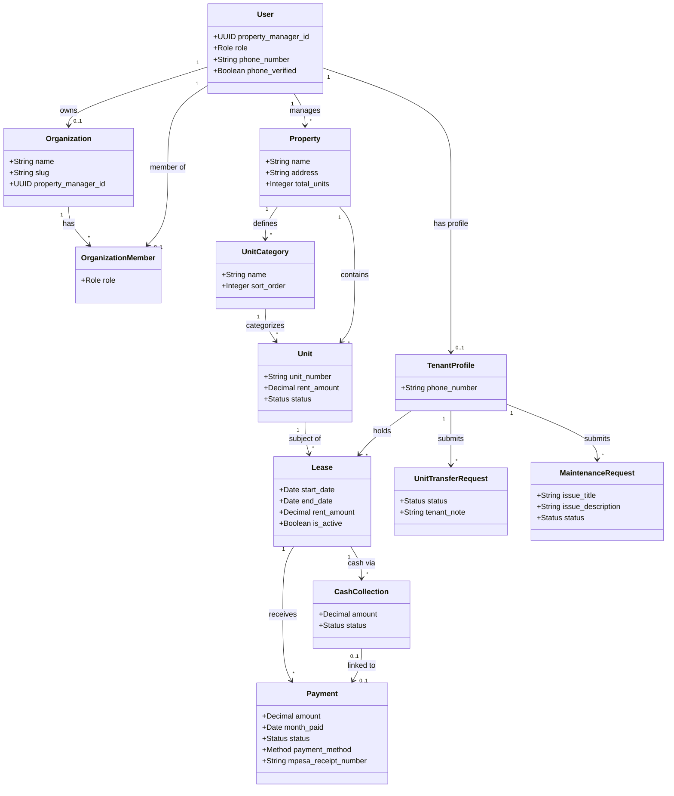
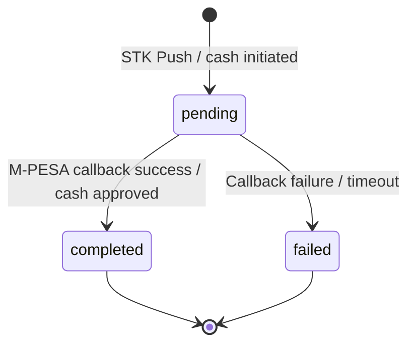
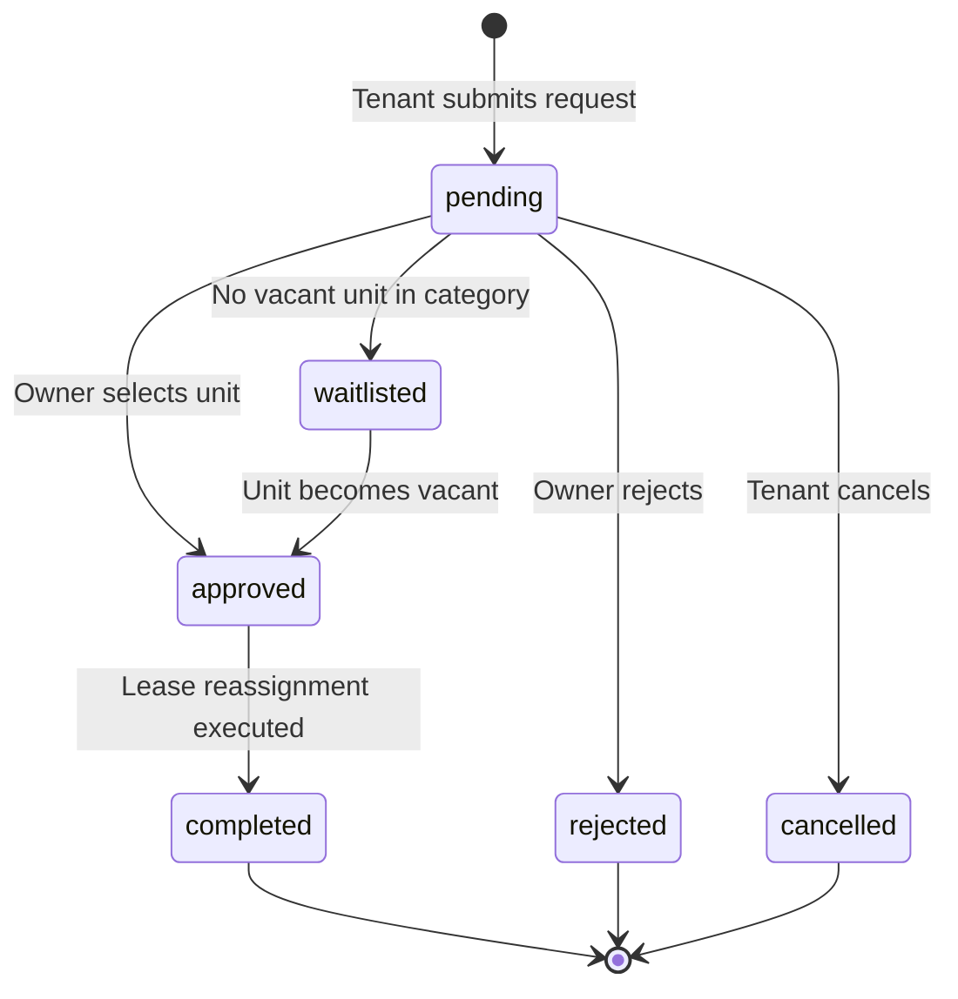
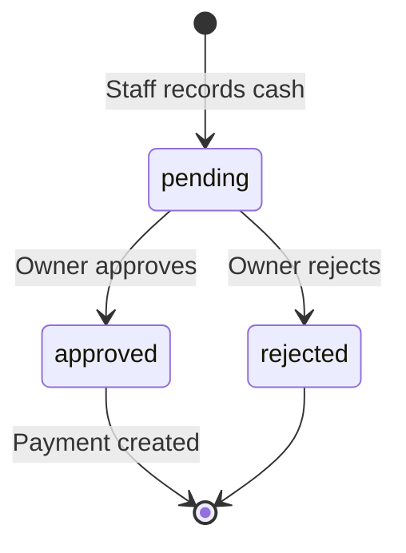
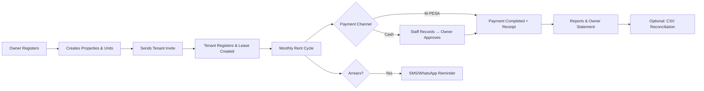
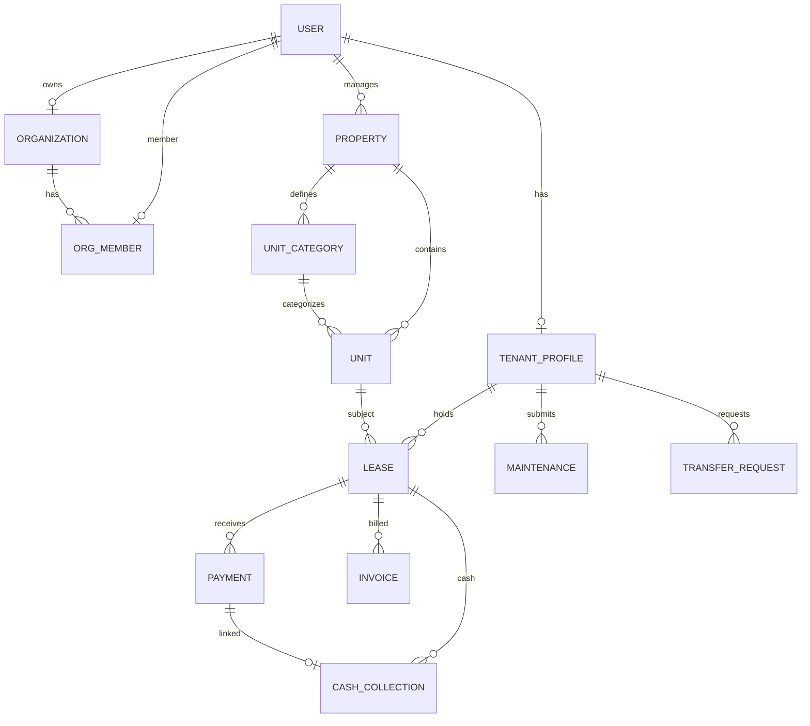

# SYSTEM ANALYSIS AND DESIGN REPORT

## Propizy: Property Management Made Easy

**A Multi-Tenant Property Management Platform for Kenya**

---

| Field | Detail |
|-------|--------|
| **Project Title** | Propizy — Property Management Made Easy |
| **Report Title** | UML, UI (Figma), Dataset, and Database Design |
| **System Type** | Web dashboard, mobile app, REST API (production deployment) |
| **Database** | PostgreSQL 16 |
| **Date** | June 2026 |

---

## Abstract

This report presents the system analysis and design artefacts for **Propizy**, a Kenya-first, multi-tenant property management platform. Propizy enables property owners to manage portfolios, collect rent via M-PESA, govern staff access, reconcile payments, and serve tenants through a mobile application. The design covers four deliverables required by the assignment: **UML diagrams** (use case, sequence, class, and state models), **UI design specifications** (Figma-ready wireframes and design system), **dataset design** (production data lifecycle and record formats), and **database design** (conceptual and logical ER models with normalization). All artefacts trace to functional requirements and to the implemented Django/PostgreSQL schema. The system is intended for real-world deployment; no synthetic seed data is loaded at startup.

---

## Table of Contents

1. [Introduction](#1-introduction)
2. [System Overview](#2-system-overview)
3. [UML Design](#3-uml-design)
4. [UI Design (Figma Specifications)](#4-ui-design-figma-specifications)
5. [Dataset Design](#5-dataset-design)
6. [Database Design](#6-database-design)
7. [Design Traceability Matrix](#7-design-traceability-matrix)
8. [Conclusion](#8-conclusion)
9. [References](#9-references)
10. [Appendices](#10-appendices)

---

## 1. Introduction

### 1.1 Background

Property management in Kenya relies heavily on manual rent collection, paper leases, and informal communication between landlords, caretakers, and tenants. M-PESA has become the dominant payment channel, yet many landlords lack integrated tools to track collections, arrears, and tenant records across multiple buildings. Propizy addresses this gap by providing a **software-as-a-service (SaaS)** platform where each property owner operates within an isolated **organization**, while tenants interact through a dedicated mobile app.

### 1.2 Problem Statement

Landlords and property managers need a system that:

- Supports **multiple properties and units** under one account
- Collects rent via **M-PESA STK Push** with automatic receipt generation
- Enforces **role-based access** between owners, staff, and tenants
- Prevents **cross-organization data leakage** in a shared-database multi-tenant architecture
- Provides **governance tools** (cash approval, reconciliation, dispute evidence) suitable for real-world financial oversight

### 1.3 Objectives of This Report

This document fulfils the assignment deliverables:

| Deliverable | Section | Output |
|-------------|---------|--------|
| UML Design | §3 | Use case, sequence, class, and state diagrams |
| Figma / UI Design | §4 | Design system, screen inventory, wireframe specifications |
| Dataset Design | §5 | Data entities, formats, lifecycle, and validation rules |
| Database Design | §6 | ER diagrams, table dictionary, normalization, constraints |

### 1.4 Scope

**In scope:** Authentication, organization management, properties/units, invite-only tenant onboarding, leases, M-PESA and cash payments, maintenance, room transfers, governance (reconciliation, integrity, evidence), and reporting.

**Out of scope:** Subscription billing integration, native iOS/Android store distribution, and third-party accounting ERP connectors (exports are CSV/PDF only).

### 1.5 Methodology

Design follows standard structured analysis:

1. **Requirements** — functional and non-functional requirements documented in `docs/reports/FUNCTIONAL_AND_NONFUNCTIONAL_REQUIREMENTS.md`
2. **Process modelling** — Yourdon & Coad DFD (context, Level 1, Level 2) in `docs/diagrams/`
3. **Object modelling** — UML class and sequence diagrams (§3)
4. **Data modelling** — Chen conceptual ER and Crow's Foot logical ER (§6)
5. **Interface modelling** — Figma-ready UI specifications (§4)

---

## 2. System Overview

### 2.1 Architecture

Propizy uses a **three-tier, API-centric architecture**:

```
┌─────────────────────┐     ┌─────────────────────┐
│  React Web Dashboard │     │ React Native Mobile │
│  (Owners & Staff)    │     │ (Tenants)           │
└──────────┬──────────┘     └──────────┬──────────┘
           │         HTTPS / JSON       │
           └────────────┬───────────────┘
                        ▼
           ┌────────────────────────────┐
           │  Django REST Framework API │
           │  users | properties |       │
           │  payments | maintenance    │
           └────────────┬───────────────┘
                        ▼
           ┌────────────────────────────┐
           │  PostgreSQL 16             │
           │  + media/ file storage     │
           └────────────────────────────┘
```

### 2.2 Actors and Platforms

| Actor | Platform | Primary responsibilities |
|-------|----------|-------------------------|
| **Property Owner** | Web dashboard | Full org admin, approvals, exports, governance |
| **Staff / Caretaker** | Web dashboard | Record cash, view maintenance; financial writes blocked |
| **Tenant** | Mobile app | Pay rent, submit maintenance, request room transfers |
| **Safaricom M-PESA** | External API | STK Push initiation and payment callbacks |

### 2.3 Multi-Tenancy Model

Propizy implements **shared database, shared schema** multi-tenancy:

- Each owner registration creates an `Organization` with a unique `property_manager_id` (UUID).
- All manager-scoped queries filter by `property_manager_id`.
- Staff inherit organization scope via `OrganizationMember`.
- Tenants link to their manager's `User` record; data is scoped through that relationship.
- Automated security tests (`users/security_tests.py`) verify IDOR prevention across organizations.

### 2.4 Existing Process and ER Diagrams

The following diagram source files support this report and should be exported as figures (see Appendix A):

| Figure | File | Description |
|--------|------|-------------|
| Context Diagram | `docs/diagrams/propizy-4.2-context-diagram.drawio` | Level 0 DFD — system boundary |
| DFD Level 1 | `docs/diagrams/propizy-4.3-dfd-level1.xml` | Eight main processes |
| DFD Level 2 | `docs/diagrams/propizy-4.3-dfd-level2.xml` | Decomposition of processes 3–6 |
| Database ER | `docs/diagrams/propizy-database-er-diagram.xml` | Full logical schema (Crow's Foot) |
| Conceptual ER | `docs/diagrams/propizy-4.4-er-diagram.drawio` | Chen notation subset |

---

## 3. UML Design

UML complements the DFD process models by describing **object interactions**, **actor goals**, and **entity structure**.

### 3.1 Use Case Diagram

**Figure 3.1** — Use Case Diagram for Propizy



#### 3.1.1 Use Case Descriptions (Selected)

**UC-04: Invite Tenant**

| Field | Description |
|-------|-------------|
| **Actor** | Property Owner |
| **Preconditions** | Owner authenticated; at least one vacant unit exists |
| **Main flow** | 1. Owner opens Tenants page → 2. Enters tenant email and phone → 3. Selects target unit → 4. System creates `TenantInvite` with UUID token → 5. Owner shares invite link (`propizy://invite/<token>`) |
| **Postconditions** | Invite record stored; expires after configured period if unused |
| **Requirements** | FR-10, FR-11 |

**UC-07: Pay Rent via M-PESA**

| Field | Description |
|-------|-------------|
| **Actor** | Tenant |
| **Preconditions** | Active lease; tenant authenticated on mobile |
| **Main flow** | 1. Tenant opens Pay screen → 2. Confirms amount → 3. System creates pending `Payment` → 4. STK Push sent to Safaricom → 5. Tenant enters M-PESA PIN → 6. Callback received → 7. Payment marked completed → 8. Receipt PDF generated |
| **Alternate flow** | 3a. Daraja credentials absent → simulation mode auto-completes payment |
| **Postconditions** | `Payment.status = completed`; receipt stored in `media/receipts/` |
| **Requirements** | FR-13, FR-14, FR-17, FR-39, FR-40 |

**UC-10: Approve Room Transfer**

| Field | Description |
|-------|-------------|
| **Actor** | Property Owner |
| **Preconditions** | Pending `UnitTransferRequest`; vacant unit in desired category |
| **Main flow** | 1. Owner reviews request on Transfers page → 2. Selects vacant unit → 3. System deactivates old lease → 4. Old unit marked vacant → 5. New lease created on assigned unit → 6. Request status set to `completed` |
| **Postconditions** | Tenant's `current_unit` updated; transfer history preserved |
| **Requirements** | FR-28, FR-31, FR-32 |

---

### 3.2 Sequence Diagrams

#### 3.2.1 Tenant Onboarding (Invite → Lease)

**Figure 3.2** — Sequence: Tenant Onboarding

```mermaid
sequenceDiagram
    actor Owner
    participant Web as Web Dashboard
    participant API as Django API
    participant DB as PostgreSQL
    actor Tenant
    participant Mobile as Mobile App

    Owner->>Web: Create tenant invite (email, phone, unit)
    Web->>API: POST /api/auth/tenant-invites/
    API->>DB: INSERT TenantInvite
    API-->>Web: Invite token + link
    Owner->>Tenant: Share propizy://invite/{token}

    Tenant->>Mobile: Open invite link
    Mobile->>API: POST /api/auth/register-tenant/ (token, credentials)
    API->>DB: Validate token; INSERT User, TenantProfile
    API->>DB: INSERT Lease (active); UPDATE Unit.status = occupied
    API->>API: Generate lease agreement PDF
    API->>DB: UPDATE Lease.pdf_upload
    API-->>Mobile: JWT tokens + lease summary
```

#### 3.2.2 M-PESA Rent Payment

**Figure 3.3** — Sequence: M-PESA Payment



#### 3.2.3 Cash Collection with Owner Approval

**Figure 3.4** — Sequence: Cash Collection Approval

```mermaid
sequenceDiagram
    actor Staff
    participant Web as Web Dashboard
    participant API as Django API
    participant DB as PostgreSQL
    actor Owner

    Staff->>Web: Record cash collection (amount, photo)
    Web->>API: POST /api/cash-collections/
    API->>DB: INSERT CashCollection (status=pending)
    API->>DB: INSERT OwnerAlert (cash_pending)
    API-->>Web: Pending approval notice

    Owner->>Web: Review pending cash
    Web->>API: POST /api/cash-collections/{id}/approve/
    API->>DB: INSERT Payment (method=cash, completed)
    API->>DB: UPDATE CashCollection (approved, linked_payment)
    API->>API: Generate receipt PDF
    API-->>Web: Approved; collection rate updated
```

---

### 3.3 Class Diagram

**Figure 3.5** — Domain Class Diagram (core entities)



**Design notes:**

- `User` serves dual roles (`MANAGER` or `TENANT`) with `property_manager_id` assigned on manager registration.
- `Lease` resolves the many-to-many relationship between `TenantProfile` and `Unit`.
- `Payment` enforces business rules via a unique constraint on `(lease, month_paid)` for active statuses.
- Governance entities (`CashCollection`, `MpesaStatementImport`, `EvidenceSnapshot`) extend the payment cluster; see §6 for full schema.

---

### 3.4 State Diagrams

#### 3.4.1 Payment State Machine

**Figure 3.6** — Payment States



#### 3.4.2 Unit Transfer Request State Machine

**Figure 3.7** — Transfer Request States



#### 3.4.3 Cash Collection State Machine

**Figure 3.8** — Cash Collection States



---

## 4. UI Design (Figma Specifications)

This section provides **Figma-ready UI specifications** for Propizy. Screens are organized into a design system and two client applications. Figures may be produced in Figma following these specs, or exported as screenshots from the implemented React web and React Native mobile applications.

### 4.1 Design System

| Token | Value | Usage |
|-------|-------|-------|
| **Primary** | `#2563eb` (blue-600) | Primary buttons, active nav, mobile header |
| **Primary dark** | `#1e40af` (blue-800) | Mobile navigation header background |
| **Success** | `#16a34a` (green-600) | Approve actions, paid status |
| **Warning** | `#f59e0b` (amber-500) | Pending maintenance, waitlist |
| **Danger** | `#dc2626` (red-600) | Overdue payments, reject actions |
| **Background** | `#f8fafc` (slate-50) | Page background (web) |
| **Surface** | `#ffffff` | Cards, modals, tables |
| **Text primary** | `#1e293b` (slate-800) | Headings, values |
| **Text secondary** | `#64748b` (slate-500) | Labels, captions |
| **Font** | Inter / system sans-serif | All platforms |
| **Border radius** | 12px (`rounded-xl`) | Cards and panels |
| **Spacing unit** | 4px base (Tailwind scale) | Consistent padding |

**Components (Figma component library):**

- Primary button (filled blue)
- Secondary button (outline)
- Stat card (label + large value + subtitle)
- Data table (sortable columns, status badges)
- Sidebar navigation item (icon + label, active state)
- Mobile bottom tab bar (5 tabs)
- Status badge: `pending` (amber), `completed` (green), `failed` (red), `vacant` (blue), `occupied` (slate)

### 4.2 Information Architecture

**Web dashboard (Owner / Staff)**

```
Login / Register / Verify Phone
└── Dashboard
    ├── Properties → Property Detail
    ├── Units
    ├── Tenants (invite flow)
    ├── Leases
    ├── Payments
    ├── Arrears
    ├── Transfers (approval queue)
    ├── Maintenance
    ├── Governance (reconciliation, integrity, M-PESA config)
    ├── Reports (charts)
    ├── Activity (audit log)
    └── Team (staff invites)
```

**Mobile app (Tenant)**

```
Login / Register (invite token)
└── Tab Navigator
    ├── Home (summary)
    ├── My Unit (lease, availability, transfer)
    ├── Pay (M-PESA)
    ├── Maintenance (submit ticket)
    └── Profile (account, logout)
```

### 4.3 Web Screen Specifications

#### Screen W-01: Login

| Element | Specification |
|---------|---------------|
| **Layout** | Centred card (max-width 400px) on slate background |
| **Fields** | Username/email, password |
| **Actions** | Login (primary), link to Register |
| **API** | `POST /api/auth/login/` |
| **Maps to** | FR-02 |

#### Screen W-02: Register (Owner)

| Element | Specification |
|---------|---------------|
| **Fields** | Organization name, username, email, password, confirm password |
| **Actions** | Create account → redirect to phone verification |
| **API** | `POST /api/auth/register/` |
| **Maps to** | FR-01 |

#### Screen W-03: Dashboard

| Element | Specification |
|---------|---------------|
| **KPI cards (grid 3×2)** | Properties count, Units (occupied), Occupancy %, Collected This Month (KES), Pending Maintenance, Overdue Payments |
| **Quick actions** | Add Property, Invite Tenant, View Maintenance |
| **Empty state** | Message when `properties === 0`: "Get started: add your first property…" |
| **API** | `GET /api/auth/dashboard/` |
| **Maps to** | FR-35 |

#### Screen W-04: Properties List

| Element | Specification |
|---------|---------------|
| **Header** | "Properties" + Add Property button (Owner only) |
| **Table columns** | Name, Address, Total Units, Created |
| **Row action** | Click → Property Detail |
| **Maps to** | FR-06 |

#### Screen W-05: Tenants (Invite Flow)

| Element | Specification |
|---------|---------------|
| **Table** | Tenant name, unit, phone, lease status |
| **Invite modal** | Email, phone, unit dropdown, Generate Invite |
| **Output** | Copyable invite link `propizy://invite/{token}` |
| **Maps to** | FR-10 |

#### Screen W-06: Payments

| Element | Specification |
|---------|---------------|
| **Table columns** | Tenant, Unit, Amount, Month, Method, Status, Receipt |
| **Status badges** | pending (amber), completed (green), failed (red) |
| **Filters** | Month, property, status |
| **Maps to** | FR-13, FR-17 |

#### Screen W-07: Transfers

| Element | Specification |
|---------|---------------|
| **Queue table** | Tenant, current unit, desired category, status, date |
| **Actions (Owner)** | Approve (select vacant unit), Waitlist, Reject |
| **Status badges** | pending, waitlisted, completed |
| **Maps to** | FR-28, FR-31, FR-32 |

#### Screen W-08: Governance

| Element | Specification |
|---------|---------------|
| **Tabs** | Reconciliation, Integrity Alerts, M-PESA Config, Tax Export |
| **Reconciliation** | CSV upload, matched/orphan counts, line table |
| **Integrity** | Alert list (amount mismatch, duplicate month, unregistered phone) |
| **Maps to** | FR-20–FR-26 |

#### Screen W-09: Reports

| Element | Specification |
|---------|---------------|
| **Charts (Recharts)** | Collection rate pie, property breakdown bar, 6-month trend line |
| **Filters** | Date range, property |
| **Maps to** | FR-36 |

### 4.4 Mobile Screen Specifications

#### Screen M-01: Register (Invite)

| Element | Specification |
|---------|---------------|
| **Entry** | Deep link `propizy://invite/{token}` |
| **Fields** | Username, password (token pre-filled from URL) |
| **Header** | Blue (`#1e40af`), title "Create Account" |
| **Maps to** | FR-10 |

#### Screen M-02: Home

| Element | Specification |
|---------|---------------|
| **Content** | Greeting, current unit summary, rent due, quick Pay button |
| **Maps to** | FR-35 (tenant view) |

#### Screen M-03: My Unit

| Element | Specification |
|---------|---------------|
| **Sections** | Lease details, rent amount, lease PDF download |
| **Transfer** | Category picker, submit request, view status |
| **Availability** | Vacant units grouped by category |
| **Maps to** | FR-28, FR-30 |

#### Screen M-04: Pay Rent

| Element | Specification |
|---------|---------------|
| **Display** | Amount due (rent + utilities), month, phone number |
| **Action** | "Pay with M-PESA" (large green button) |
| **Feedback** | Loading spinner during STK; success with receipt link |
| **Tap count** | ≤ 5 taps from home to STK initiation (NFR-16) |
| **Maps to** | FR-13, FR-18 |

#### Screen M-05: Maintenance

| Element | Specification |
|---------|---------------|
| **Form** | Issue title, description |
| **List** | Previous requests with status badges |
| **Maps to** | FR-33 |

### 4.5 Navigation Wireframes (ASCII)

**Web sidebar layout:**

```
┌──────────┬────────────────────────────────────────┐
│ Propizy  │  Dashboard                             │
│ ──────── │  ┌──────┐ ┌──────┐ ┌──────┐           │
│ Dashboard│  │ KPI  │ │ KPI  │ │ KPI  │           │
│ Properties│ └──────┘ └──────┘ └──────┘           │
│ Units    │  ┌─────────────────────────────────┐  │
│ Tenants  │  │ Quick Actions                    │  │
│ Payments │  └─────────────────────────────────┘  │
│ ...      │                                        │
└──────────┴────────────────────────────────────────┘
```

**Mobile tab layout:**

```
┌─────────────────────────────┐
│  Propizy          (header)  │
├─────────────────────────────┤
│                             │
│      [ Screen content ]     │
│                             │
├─────────────────────────────┤
│ 🏠   🏢   💰   🔧   👤     │
│ Home Unit Pay  Fix  Me      │
└─────────────────────────────┘
```

### 4.6 Figma Deliverable Checklist

When building the Figma file for submission:

1. Create **Design System** page with colours, typography, buttons, badges
2. Create **Web — 9 frames** (W-01 through W-09) at 1440×900
3. Create **Mobile — 5 frames** (M-01 through M-05) at 390×844 (iPhone 14)
4. Add **prototype links**: Login → Dashboard → Tenants → Invite modal
5. Add **prototype links**: Mobile Login → Home → Pay → Success
6. Export each frame as PNG (2×) for Word/PDF insertion

---

## 5. Dataset Design

Propizy is a **production system**. Data is created exclusively through real user actions and external integrations — no seed or demo data is loaded at deployment.

### 5.1 Data Philosophy

| Principle | Implementation |
|-----------|----------------|
| **No synthetic seed data** | Docker entrypoint runs migrations only; `seed.py` removed |
| **Invite-only tenants** | Tenants exist only after accepting a valid `TenantInvite` |
| **Audit trail** | `ActivityLog` and `OwnerAlert` record sensitive actions |
| **Immutable evidence** | `EvidenceSnapshot` stores SHA-256 hash of exported bundles |
| **File-backed documents** | PDFs stored in `media/` with database references |

### 5.2 Data Entities and Sources

| Entity | Created by | Source |
|--------|-----------|--------|
| `User` (Owner) | Self-registration | Web Register form |
| `Organization` | Auto on owner registration | API trigger |
| `User` (Staff) | Staff invite acceptance | `StaffInvite` token |
| `User` (Tenant) | Tenant invite acceptance | `TenantInvite` token |
| `Property`, `Unit`, `UnitCategory` | Owner/Staff (read) | Web dashboard CRUD |
| `Lease` | System on invite acceptance | `properties/services.py` |
| `Payment` | Tenant M-PESA or approved cash | Daraja callback / approval workflow |
| `Invoice`, receipt PDFs | System on payment events | PDF generation services |
| `MaintenanceRequest` | Tenant | Mobile app form |
| `UnitTransferRequest` | Tenant | Mobile app form |
| `MpesaStatementLine` | Owner CSV upload | Reconciliation import |
| `EvidenceSnapshot` | Owner export action | Governance module |

### 5.3 Record Format Specifications

#### 5.3.1 Organization Registration Record

| Field | Type | Required | Validation |
|-------|------|----------|------------|
| `name` | string(255) | Yes | Non-empty |
| `slug` | slug | Yes | Unique, auto from name |
| `owner_id` | FK → User | Yes | OneToOne |
| `property_manager_id` | UUID | Yes | Auto-generated, unique |

#### 5.3.2 Tenant Invite Record

| Field | Type | Required | Validation |
|-------|------|----------|------------|
| `email` | email | Yes | Valid email format |
| `phone_number` | string(15) | Yes | Kenya format `2547XXXXXXXX` |
| `unit_id` | FK → Unit | No | Must be vacant if set |
| `token` | UUID | Yes | Unique, non-editable |
| `expires_at` | datetime | Yes | Must be future at creation |
| `used_at` | datetime | No | Set on successful registration |

#### 5.3.3 Payment Record

| Field | Type | Required | Validation |
|-------|------|----------|------------|
| `tenant_id` | FK | Yes | Must belong to org |
| `lease_id` | FK | Yes | Must be active |
| `amount` | decimal(10,2) | Yes | > 0 |
| `month_paid` | date | Yes | First day of month; unique per lease for pending/completed |
| `status` | enum | Yes | pending, completed, failed |
| `payment_method` | enum | Yes | mpesa, cash, bank |
| `mpesa_receipt_number` | string(50) | No | Set on M-PESA completion |
| `transaction_id` | string(100) | No | Unique when present |

#### 5.3.4 M-PESA Statement CSV (Import Format)

Expected columns for reconciliation upload:

| Column | Description | Example |
|--------|-------------|---------|
| Transaction Date | Date/time of transaction | `2026-06-15 14:32:00` |
| Receipt Number | M-PESA receipt | `SHK7X9Y2Z1` |
| Phone Number | Payer phone | `254712345678` |
| Amount | Transaction amount (KES) | `17500.00` |
| Account Reference | Bill reference | `UNIT01-JUN2026` |

Import creates `MpesaStatementImport` (header) and `MpesaStatementLine` (one row per CSV line). Matching engine links lines to `Payment` records or flags as `orphan`.

### 5.4 Data Lifecycle



### 5.5 Data Volume Estimates (Production Planning)

| Entity | Typical org (10 units) | Growth rate |
|--------|------------------------|-------------|
| Users | 1 owner + 1–2 staff + 10 tenants | Linear with units |
| Payments | 10/month | 120/year |
| Invoices | 10/month | 120/year |
| Maintenance requests | 2–5/month | Variable |
| Activity logs | 50–200/month | Event-driven |

### 5.6 Data Integrity Rules

| Rule | Enforcement |
|------|-------------|
| One active payment per lease per month | DB unique constraint on `(lease, month_paid)` |
| One active transfer request per tenant | Application logic in `transfer_service.py` |
| Cross-org isolation | Query filtering by `property_manager_id` |
| Cash not counted until approved | `CashCollection.status` workflow |
| Evidence tamper detection | SHA-256 hash on `EvidenceSnapshot` |

### 5.7 Privacy and Retention

- Personal data: names, emails, phone numbers stored in `User` and `TenantProfile`.
- Financial records retained for audit; no automatic purge in v1.
- Phone verification via `PhoneVerificationCode` (6-digit OTP, expiry enforced).
- Production deployment requires HTTPS (NFR-05) and hashed passwords (NFR-09).

---

## 6. Database Design

### 6.1 Design Approach

| Aspect | Decision |
|--------|----------|
| **DBMS** | PostgreSQL 16 |
| **Modelling tool** | diagrams.net (Crow's Foot) + Django ORM |
| **Naming** | Django default table names (`users_user`, `properties_lease`, etc.) |
| **Multi-tenancy** | Shared schema; `property_manager_id` discriminator |
| **Migrations** | Django migrations version-controlled in `*/migrations/` |

### 6.2 Conceptual Model (Chen Notation)

**Figure 6.1** — See `docs/diagrams/propizy-4.4-er-diagram.drawio` (page 4.4a).

Core entities and relationships:

| Entity | Key attributes | Relationships |
|--------|----------------|---------------|
| **USER** | username, role, property_manager_id | Owns ORGANIZATION (1:1); manages PROPERTY (1:N); has TENANT_PROFILE (1:1) |
| **ORGANIZATION** | name, slug, property_manager_id | Has ORG_MEMBER (1:N); has MPESA_CONFIG (1:1) |
| **PROPERTY** | name, address | Contains UNIT (1:N); defines UNIT_CATEGORY (1:N) |
| **UNIT** | unit_number, rent_amount, status | Subject of LEASE (1:N) |
| **LEASE** | start_date, end_date, is_active | Receives PAYMENT (1:N); receives INVOICE (1:N) |
| **PAYMENT** | amount, month_paid, status | Matched by MPESA_LINE (1:N) |

The lease entity resolves the many-to-many tenant–unit relationship.

### 6.3 Logical Model (Crow's Foot)

**Figure 6.2** — See `docs/diagrams/propizy-database-er-diagram.xml`.

The logical schema comprises **24 tables** mapped from Django models:

| # | Table | Django model | App |
|---|-------|--------------|-----|
| 1 | users_user | User | users |
| 2 | users_phoneverificationcode | PhoneVerificationCode | users |
| 3 | users_organization | Organization | users |
| 4 | users_organizationmember | OrganizationMember | users |
| 5 | users_tenantinvite | TenantInvite | users |
| 6 | users_staffinvite | StaffInvite | users |
| 7 | users_activitylog | ActivityLog | users |
| 8 | users_organizationmpesaconfig | OrganizationMpesaConfig | users |
| 9 | users_owneralert | OwnerAlert | users |
| 10 | properties_property | Property | properties |
| 11 | properties_unitcategory | UnitCategory | properties |
| 12 | properties_unit | Unit | properties |
| 13 | properties_tenantprofile | TenantProfile | properties |
| 14 | properties_lease | Lease | properties |
| 15 | properties_unittransferrequest | UnitTransferRequest | properties |
| 16 | payments_payment | Payment | payments |
| 17 | payments_paymentreminder | PaymentReminder | payments |
| 18 | payments_invoice | Invoice | payments |
| 19 | payments_cashcollection | CashCollection | payments |
| 20 | payments_utilitycharge | UtilityCharge | payments |
| 21 | payments_mpesastatementimport | MpesaStatementImport | payments |
| 22 | payments_mpesastatementline | MpesaStatementLine | payments |
| 23 | payments_evidencesnapshot | EvidenceSnapshot | payments |
| 24 | maintenance_maintenancerequest | MaintenanceRequest | maintenance |

### 6.4 Core Table Dictionary

#### Table: users_user

| Column | Type | Constraints | Description |
|--------|------|-------------|-------------|
| id | SERIAL | PK | Surrogate key |
| username | VARCHAR(150) | UNIQUE, NOT NULL | Login identifier |
| email | VARCHAR(254) | | Contact email |
| password | VARCHAR(128) | NOT NULL | Hashed password |
| role | VARCHAR(10) | NOT NULL | MANAGER or TENANT |
| property_manager_id | UUID | INDEX | Tenant scope key (managers) |
| phone_number | VARCHAR(15) | | E.164 format |
| phone_verified | BOOLEAN | DEFAULT false | OTP verification flag |
| manager_id | INTEGER | FK → users_user, NULL | Tenant's managing user |

#### Table: users_organization

| Column | Type | Constraints | Description |
|--------|------|-------------|-------------|
| id | SERIAL | PK | |
| name | VARCHAR(255) | NOT NULL | Display name |
| slug | VARCHAR(50) | UNIQUE | URL-safe identifier |
| property_manager_id | UUID | UNIQUE, INDEX | Org isolation key |
| owner_id | INTEGER | FK → users_user, UNIQUE | One owner per org |
| created_at | TIMESTAMP | NOT NULL | Registration time |

#### Table: properties_unit

| Column | Type | Constraints | Description |
|--------|------|-------------|-------------|
| id | SERIAL | PK | |
| property_id | INTEGER | FK → properties_property | Parent property |
| category_id | INTEGER | FK → properties_unitcategory, NULL | Room type |
| unit_number | VARCHAR(50) | NOT NULL | Unique per property |
| rent_amount | DECIMAL(10,2) | NOT NULL | Monthly rent (KES) |
| status | VARCHAR(10) | NOT NULL | vacant or occupied |

**Unique constraint:** `(property_id, unit_number)`

#### Table: properties_lease

| Column | Type | Constraints | Description |
|--------|------|-------------|-------------|
| id | SERIAL | PK | |
| tenant_id | INTEGER | FK → properties_tenantprofile | Lessee |
| unit_id | INTEGER | FK → properties_unit | Leased unit |
| start_date | DATE | NOT NULL | Lease start |
| end_date | DATE | NOT NULL | Lease end |
| rent_amount | DECIMAL(10,2) | NOT NULL | Agreed rent |
| is_active | BOOLEAN | DEFAULT true | Current lease flag |
| pdf_upload | VARCHAR(100) | NULL | Lease agreement file path |

#### Table: payments_payment

| Column | Type | Constraints | Description |
|--------|------|-------------|-------------|
| id | SERIAL | PK | |
| tenant_id | INTEGER | FK → properties_tenantprofile | Payer |
| lease_id | INTEGER | FK → properties_lease | Associated lease |
| amount | DECIMAL(10,2) | NOT NULL | Amount paid |
| month_paid | DATE | NOT NULL | Billing month (day=1) |
| status | VARCHAR(10) | NOT NULL | pending/completed/failed |
| payment_method | VARCHAR(10) | DEFAULT mpesa | mpesa/cash/bank |
| mpesa_receipt_number | VARCHAR(50) | | Safaricom receipt |
| transaction_id | VARCHAR(100) | UNIQUE, NULL | External txn ID |
| receipt_pdf | VARCHAR(100) | NULL | Generated receipt path |

**Unique constraint:** `(lease_id, month_paid)` WHERE status IN ('pending', 'completed')

### 6.5 Normalization Analysis

The schema is in **Third Normal Form (3NF)**:

**1NF — Atomic values:** All columns hold single values. No repeating groups (e.g. units are separate rows, not comma-separated lists in `Property`).

**2NF — Full functional dependency:** All non-key attributes depend on the entire primary key. Junction tables (`OrganizationMember`, `Lease`) eliminate partial dependencies.

**3NF — No transitive dependencies:**

| Design decision | Normalization rationale |
|-----------------|------------------------|
| `Unit` separate from `Property` | Avoids repeating unit attributes in property rows |
| `UnitCategory` separate from `Unit` | Category name/description not duplicated per unit |
| `Payment` separate from `Lease` | Payment history is a separate fact table (1:N) |
| `TenantProfile` separate from `User` | Tenant-specific attributes isolated from auth table |
| `OrganizationMember` junction | Resolves M:N between User and Organization |
| `Lease` junction | Resolves M:N between TenantProfile and Unit |

**Denormalization (intentional):**

- `Property.total_units` — cached count for dashboard display; updated on unit CRUD.
- `rent_amount` copied to `Lease` at creation — preserves historical rent if unit rent changes later.

### 6.6 Referential Integrity

| Relationship | ON DELETE | Rationale |
|--------------|-----------|-----------|
| Organization → User (owner) | CASCADE | Org cannot exist without owner |
| Unit → Property | CASCADE | Units belong to property |
| Lease → TenantProfile | CASCADE | Leases tied to tenant lifecycle |
| Payment → Lease | CASCADE | Payments cannot orphan |
| CashCollection → Payment (linked) | SET NULL | Preserve audit if payment removed |
| TenantInvite → Unit | SET NULL | Invite valid if unit deleted |

### 6.7 Indexes

| Table | Column(s) | Purpose |
|-------|-----------|---------|
| users_user | property_manager_id | Org-scoped queries |
| users_organization | property_manager_id | Tenant lookup |
| payments_payment | checkout_request_id | M-PESA callback matching |
| payments_mpesastatementline | receipt_number | Reconciliation matching |
| payments_evidencesnapshot | sha256_hash | Integrity verification |

### 6.8 Mermaid ER Diagram (Core Subset)

**Figure 6.3** — Core entity relationships



---

## 7. Design Traceability Matrix

| Requirement | UML artefact | UI screen | Dataset entity | DB table |
|-------------|-------------|-----------|----------------|----------|
| FR-01 Register org | UC-01 | W-02 | Organization | users_organization |
| FR-02 JWT auth | UC-01 | W-01, M-01 | User | users_user |
| FR-10 Invite tenant | UC-04 | W-05 | TenantInvite | users_tenantinvite |
| FR-13 M-PESA pay | UC-07, Seq 3.2.2 | M-04 | Payment | payments_payment |
| FR-16 Cash approval | Seq 3.2.3, State 3.4.3 | W-06, Governance | CashCollection | payments_cashcollection |
| FR-20 Reconciliation | UC-06 | W-08 | MpesaStatementLine | payments_mpesastatementline |
| FR-28 Room transfer | UC-09, State 3.4.2 | M-03, W-07 | UnitTransferRequest | properties_unittransferrequest |
| FR-33 Maintenance | UC-08 | M-05, W (Maintenance) | MaintenanceRequest | maintenance_maintenancerequest |
| FR-35 Dashboard | UC-11 | W-03 | Aggregates | Multiple tables |
| NFR-07 IDOR prevention | Class 3.3 | — | property_manager_id | users_user, users_organization |
| NFR-13 DB constraints | State 3.4.1 | — | Payment rules | payments_payment constraint |

---

## 8. Conclusion

This report documents the complete system analysis and design for Propizy across four assignment deliverables. **UML diagrams** model actor goals (use cases), temporal interactions (sequences), domain structure (classes), and business rules (state machines). **UI specifications** define a consistent design system and fourteen screens across web and mobile clients, ready for Figma implementation or screenshot export from the built application. **Dataset design** describes production data lifecycle without synthetic seed data, specifying record formats for registration, invites, payments, and M-PESA reconciliation imports. **Database design** presents a normalized PostgreSQL schema of 24 tables with Crow's Foot ER modelling, integrity constraints, and multi-tenant isolation via `property_manager_id`.

All design artefacts trace to functional requirements and align with the implemented Django codebase, ensuring consistency between documentation and the production-ready system.

---

## 9. References

- Bass, L., Clements, P., & Kazman, R. (2003). *Software architecture in practice* (2nd ed.). Addison-Wesley.
- Connolly, T., & Begg, C. (2015). *Database systems: A practical approach to design, implementation, and management* (6th ed.). Pearson.
- Django Software Foundation. (2024). *Django documentation* — Models and migrations. https://docs.djangoproject.com/
- Gabry, J. (2017). Writing effective use case scenarios. In *Requirements engineering fundamentals*.
- Object Management Group. (2017). *UML 2.5.1 specification*. https://www.omg.org/spec/UML/
- Safaricom. (2024). *M-PESA Daraja API documentation*. https://developer.safaricom.co.ke/
- Van Lamsweerde, A. (2009). *Requirements engineering: From system goals to UML models to software*. John Wiley & Sons.
- Yourdon, E., & Coad, P. (1991). *Object-oriented analysis* (2nd ed.). Prentice Hall.

---

## 10. Appendices

### Appendix A: Exporting Diagrams for Submission

1. Open each file in `docs/diagrams/` using [diagrams.net](https://app.diagrams.net)
2. **File → Export as → PNG** at 300 DPI (or PDF for print)
3. Insert into Word document with captions:

| Caption | Source file |
|---------|-------------|
| Figure 2.1 Context Diagram | propizy-4.2-context-diagram.drawio |
| Figure 2.2 DFD Level 1 | propizy-4.3-dfd-level1.xml |
| Figure 2.3 DFD Level 2 | propizy-4.3-dfd-level2.xml |
| Figure 6.1 Conceptual ER (Chen) | propizy-4.4-er-diagram.drawio |
| Figure 6.2 Logical ER (Crow's Foot) | propizy-database-er-diagram.xml |

4. Mermaid diagrams in §3 and §6 can be rendered at [mermaid.live](https://mermaid.live) and exported as PNG.

### Appendix B: Figma Submission Steps

1. Create Figma file: **Propizy UI Design**
2. Follow §4.1 design tokens and §4.6 checklist
3. Export 14 frames as PNG
4. Insert as Figures 4.1–4.14 in the Word report

### Appendix C: Word Document Assembly

Recommended chapter mapping when converting this Markdown to Word:

| Word chapter | Source section |
|--------------|----------------|
| Chapter 1: Introduction | §1 |
| Chapter 2: System Overview & DFD | §2 + Appendix A figures |
| Chapter 3: UML Design | §3 |
| Chapter 4: UI Design | §4 + Figma exports |
| Chapter 5: Dataset Design | §5 |
| Chapter 6: Database Design | §6 + ER figures |
| Chapter 7: Traceability | §7 |
| Chapter 8: Conclusion | §8 |

### Appendix D: Related Project Files

| File | Purpose |
|------|---------|
| `docs/reports/FUNCTIONAL_AND_NONFUNCTIONAL_REQUIREMENTS.md` | Full FR/NFR list |
| `docs/reports/CHAPTER_FOUR_IMPLEMENTATION.md` | Implementation narrative |
| `docs/diagrams/propizy-er-diagram-simple.md` | Mermaid ER reference |
| `backend/users/models.py` | User/org schema source |
| `backend/properties/models.py` | Property/lease schema source |
| `backend/payments/models.py` | Payment schema source |
| `backend/maintenance/models.py` | Maintenance schema source |

---

*End of Report*
